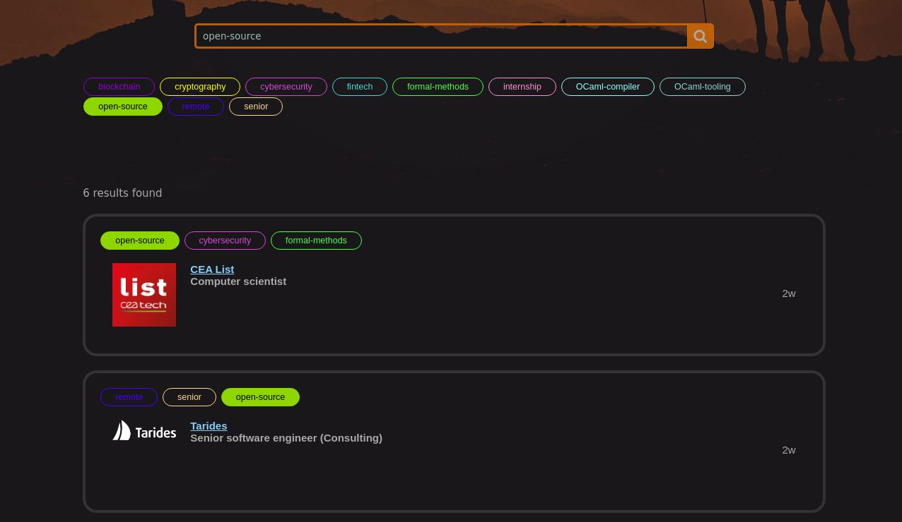

A few days ago, I wondered how we could improve the user friendliness of [ocaml.org/jobs](https://ocaml.org/jobs), the page listing interesting job offers. Featuring companies that really use OCaml in their stack, and not just list it on their job offer among 9 other programming languages. Looking up for ocaml job openings on general job boards is not really helpful because of this.

Curating interesting job offers seems to be the way to go for now. Companies looking for engineers can directly contribute the the ocaml.org repository to add their opening and it will be added to the listing, if approved by the website maintainers.

But, what I find frustrating is the UI/UX. The details of each opening are not displayed on the page, you basically click on the entry and are redirected to the company's website. The only filter available is the location (country, and whether the job is remote).

## Tags! Tags! Tags!

My first take was that it would be neat to have a search bar to allow the user to have custom searches. And what about adding custom keywords to make that search easier? These tags could be extracted from the job offers but for a first draft let's add them manually.
I quickly duplicated the job openings data in some database and got to work. After I got the prototype working. Here is what it looks like:

The user interface is pretty basic, the tags and the search bar are synchronised, and filter the entries according to the query. It could be improved, for the moment it doesn't try to match the job title or the job description. But that could easily be improved, and we could imagine extracting more information from the original openings (hiring process, salary range, benefits, etc.) to make a better experience for job applicants.

The whole design is shamelessly inspired from [remoteok.com](https://remoteok.com), not as polished, but good enough for a preview. I wanted to show it around to a few colleagues to gather some opinions, purchased the [ocamljobs.com](https://ocamljobs.com) domain (yes I got carried away, lesson learned: let's just host everything on [guillaumepetiot.com](https://guillaumepetiot.com) next time). The UX mainly got positive reviews so far. Yay!

## What now?

Well the consensus is that the search feature should end up on [ocaml.org/jobs](https://ocaml.org/jobs). I will open a few pull requests to do so in the following weeks. But this has been a fun project and made me use skills that I don't often have the opportunity to use.
In the meantime, the live preview is still [there](https://ocamljobs.com).

Now I have to figure out what to do with the domain when everything will be upstreamed to the community repository (ideas are welcome!).
